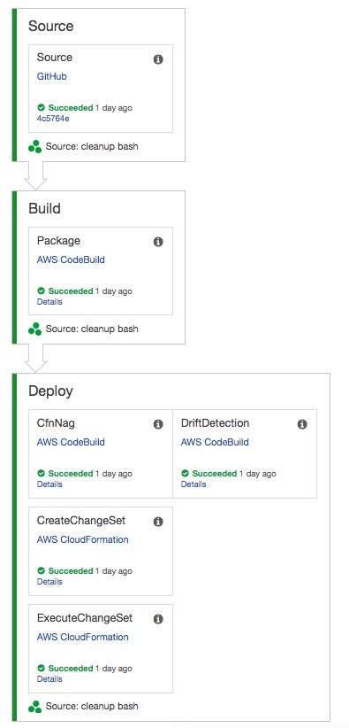

# Overview
(created for blog post [Drift Detection in Continuous Delivery Pipelines](https://stelligent.com/2018/11/13/drift-detection-in-continuous-delivery-pipelines))

This repo contains a simple API written in Go that runs as a Lambda function behind API Gateway.  The `toolchain` directory contains CodePipeline and CodeBuild spec files to define a continuous delivery pipeline for provisioning the API.  

Additionally, the pipeline leverages drift detection to fail the pipeline if manual changes have been made to infrastructure between deployments.

# Pipeline
To provision the drifter pipeline, fork this repo and then run the following with your GitHub personal access token:

```
cd toolchain
make deploy GITHUB_TOKEN=xxxxxxxxxxxxx GITHUB_USER=your_user_name
```


